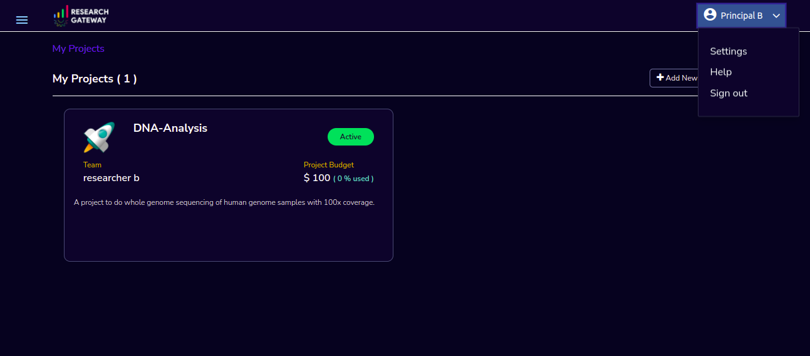

Accessing the RLCatalyst Research Gateway
=========================================

.. contents::

Sign in with Okta
-----------------

Open your **Research Gateway URL** in a browser.
Click on the **“Continue with Okta”** button under the *With other accounts* section.

You will be redirected to your organization's Okta login page:

Enter your **username** and **password**.
Click on **Sign in** to proceed.

Upon successful authentication, you will be redirected back to the Research Gateway dashboard, which serves as the landing page for accessing your projects and services.

Sign in with Existing User (Email Login)
----------------------------------------

Open your **Research Gateway URL** in a browser.
Under *With existing account*:

Enter your **registered email address**.

Click on the **Next** button.You will be redirected to a password entry screen.

Enter your **password** and click **Continue**.

Upon successful authentication, you will be redirected back to the Research Gateway dashboard, which serves as the landing page for accessing your projects and services.

Sign Out Process
----------------

Login to the Research Gateway. Use details from :ref:`Appendix A<Appendix A>` for  Email, Password as per password policy. Click on the dropdown bar which is at the top
Select “Sign out” option. Through this user logged out from the portal.

   
If sign out is successful you can navigate to the logout page. Through the "Click here to login" button you can navigate to the login page.

If sign out is unsuccessful you can see a message like "**Something went wrong while logging you out, we are working on this**".

Forgot Password
---------------

In case a user would like to reset his password, the reset password screen can be accessed from the sign in page. Choose the "Forgot Password" link.

On clicking the link the user is navigated to the reset password screen.  

Fill in the following details

.. list-table:: 
   :widths: 50, 50
   :header-rows: 1

   * - Field
     - Details
   * - Email ID
     - <Enter your registered Email ID>

   
Click on "Send Reset link" button. If the provided details are valid, the verification link that has been sent to registered email to reset the password. On clicking the link in the email, the user is prompted to change password screen.  

.. note::
  
  The password policy should meet the following requirement
   a. The minimum password length of 8 characters and a maximum of 16 characters.
   b. It should have at least one lower case character(a-z).
   c. It should have at least one upper case character(A-Z).
   d. It should have at least one number(0-9).
   e. It should have at least one special character (= + - ^ $ * . [ ] { } ( ) ? ! @ # % & / , > < ' : ; | _ ~).

If the password change is successful you can navigate to the verification successful page. Through the "Click here to login button" you can navigate to the login screen. If the password change is unsuccessful you can see the verification error screen.

.. note:: If a user tries to reset password more than 10 times it will display the message like **“Attempt limit exceeded. Please try again”**

Session Timeout
-------------------------

If the user is idle for more than 15 minutes and then performs any activity on the website, the current session will be logged out with a red toaster message and the user will be routed to the login page. In an enterprise deployment, the duration of the timeout can be customized.

