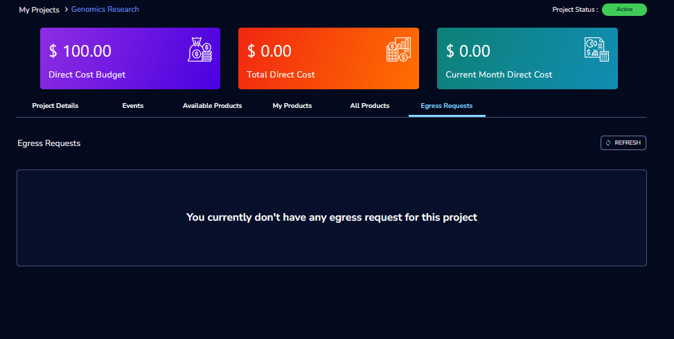

Creating a Secure Research Environment 
========================================
 
This is a premium feature and available only to customer who are subscribed to that feature. 

**1. Setting up a SRE Enabled AWS Account** 

 a. Create a Setting in RG using your AWS account.  

 .. image:: images/SecureAccount_form1.png

 .. image:: images/SecureAccount_form2.png 

 b. Create a stack and Secure VPC using the cft in the project account in the same region where the setting is created, click the `link <https://github.com/RLOpenCatalyst/rgdeploy/blob/main/SRE/Network-CFTS/vpc-squid.yml>`_ to download the CloudFormation template (CFT) file from the GitHub repository.
    Please save the file with a friendly and identifiable name for future reference. 

 .. note:: Secure VPC will be created as part of stack creation. ALB will be created as part of Secure Research Project creation in step 3. 

 c. Please note down the following output values from your CloudFormation stack outputs.

   .. list-table:: 
      :widths: 50
      :header-rows: 1

      * - Network Details
      * - vpc
      * - publicSubnet1
      * - publicSubnet2
      * - privateSubnet
      * - entryPointSG
      * - workspaceSG
      * - interfaceEndpointSG

 d. Prepare and upload the Lambda ZIP package to an S3 bucket in the same region.

   1. Clone the deployment repository from GitHub:

   .. code-block:: bash

      git clone https://github.com/RLOpenCatalyst/rgdeploy.git

   2. Navigate to the Lambda resources directory:

   .. code-block:: bash

      cd rgdeploy/SRE/lambdaresources

   3. Install the required Node.js dependencies:

   .. code-block:: bash

      npm install

   This will create the necessary ``node_modules`` folder inside the directory.

   4. Create a ZIP archive of the entire ``lambdaresources`` folder (including the dependencies):

   .. code-block:: bash

      cd ..
      zip -r egress-copy.zip lambdaresources/

   5. Upload the generated ``egress-copy.zip`` file to an S3 bucket in the same region where the CloudFormation stack will be deployed.

   You can upload the ZIP using the AWS Console or AWS CLI:

   .. code-block:: bash

      aws s3 cp egress-copy.zip s3://<your-s3-bucket-name>/

   .. note:: Ensure the S3 bucket is in the **same region** where the Lambda stack will be created, as cross-region Lambda deployments are not supported via S3.

 e. Create a stack using the CloudFormation template that provisions both the Lambda function and the egress-related resources in the same project account and region where the setting is created.
    Click the `link <https://github.com/RLOpenCatalyst/rgdeploy/blob/topic-release/SRE/Egress/Setup-templates/egressresources.yml>`_  to download the CloudFormation template and save the file with an identifiable name.

    .. note:: Ensure that the Lambda ZIP file is already uploaded to an S3 bucket in the same region. You will be prompted to enter parameters such as the S3 bucket name, S3 object key, and Lambda function name during stack creation.

..

 f. After deploying the CloudFormation stack, create an inline policy to allow the RG Project Role to invoke the Lambda function via Function URL.

   Follow these steps in the AWS Console:

   1. Navigate to the **IAM** service.
   2. Click on **Roles** from the left menu.
   3. Search for the role named: ``RG-Portal-ProjectRole-PROD`` (or your project-specific role).
   4. Select the role from the list to open its details.
   5. In the **Permissions** tab, scroll to the bottom and click **Add inline policy**.
   6. Select the **JSON** tab in the policy editor.
   7. Paste the following JSON policy, replacing the placeholder `< Replace with Egress Store Lambda Arn >` with the actual **Lambda ARN** copied from the CloudFormation stack outputs:

   .. code-block:: json

      {
         "Version": "2012-10-17",
         "Statement": [
               {
                  "Effect": "Allow",
                  "Action": "lambda:InvokeFunctionUrl",
                  "Resource": "< Replace with Egress Store Lambda Arn >",
                  "Condition": {
                     "StringEquals": {
                           "lambda:FunctionUrlAuthType": "AWS_IAM"
                     }
                  }
               }
         ]
      }

   8. Click **Review policy**.
   9. Provide a policy name, for example: ``InvokeLambdaPolicy``.
   10. Click **Create policy** to complete the inline policy attachment.

  .. note:: This step is mandatory to allow Research Gateway to approve egress requests. Without this permission, **egress requests will fail to approve** since the Lambda function cannot be invoked from the portal.

 g.  Please note down the following output values from your CloudFormation stacks:

   .. list-table::
      :widths: 50
      :header-rows: 1

      * - Egress Resource Details
      * - Egress Store Bucket ARN
      * - Egress Store KMS ARN
      * - Egress Store Bucket Name
      * - Egress Store Notification Bucket Name
      * - Egress Store Lambda URL
      * - Egress Store Lambda ARN

 h. Login to Research Gateway, Navigate to Settings > Project Accounts, click the three-dot menu (⋮) next to the appropriate account, select "Update network details", and enter the noted values in the corresponding fields.

  .. image:: images/Principal_settings_update-Networkdetails.png

..

   .. image:: images/Principal_Setting_Network_details_form.png

..

  .. note:: The ALB Access Logging Bucket Name and S3 Access Logging Bucket Name fields are optional. However, if values are provided in the UI but not supported by the s3.yaml CloudFormation template, the ingress project creation will fail. Please ensure compatibility before entering these details.

..

 i. On the **Project Accounts** page in Research Gateway, once you have updated the network details, proceed to update the egress store configuration for the same account.

 Click the three-dot menu (⋮) next to the relevant project account and select **Update egress store details**.

 .. image:: images/Principal_settings_select-EgressStoreDetails.png

..

 This opens the **Egress Store Details** form. Enter the corresponding values copied from the CloudFormation stack outputs.

 .. image:: images/Update-Egress-Resources-Popup.png

..

.. note:: All fields in the Update Egress Store Details form are mandatory, except for the **Egress Store Name**, which can be a user-defined value for easier identification within Research Gateway.

   - The following values should come from the CloudFormation Stack outputs :
     
     - Egress Store Bucket ARN  
     - Egress Store KMS ARN  
     - Egress Store Bucket Name  
     - Egress Store Notification Bucket Name
     - Egress Store Lambda URL  
     - Egress Store Lambda ARN
     
   - **Egress Store Name**: This is a logical name you define to identify the egress store in Research Gateway. It can be any meaningful name of your choice (for example: ``rg-egress-store``).

Incorrect or incomplete values may result in failure of egress operations in downstream processes.

All fields in the form are mandatory. Missing or incorrect values will result in egress functionality not working as expected.

..

**2. Setting up a Data Library project**

 .. note:: Without following all steps of Step 1 If you try to create Data Library project you will see below toaster  

 .. image:: images/DatalibraryProject_incompleteSetup_errormessage.png

 You can create Data Library project for the Secure Research Environment account from Create Project form by selecting Project Type as Data Library. 

 The Data Library project is used to host sensitive datasets which are then shared to secure research projects as Internal Studies. The Data Library project also hosts Ingress buckets used by Researchers to bring in their own data/code. 

 .. note::  For this project only Amazon S3 product of Research Gateway will be assigned, and Project storage will not be created as part of project creation. 

 .. image:: images/Datalibrary_AddProject_form1.png 

..
 
 .. image:: images/Datalibrary_AddProject_form2.png  

..

 .. image:: images/Datalibrary_AddProject_form3.png  

**steps to create buckets and map them to internal studies** 

 After creating the Data Library project, you can follow below steps to create buckets and map them to internal studies: 

 a. Create S3 bucket by launching S3 product. After it is provisioned successfully upload folders by clicking on Explore action available on Product details page 

 b. Create an Internal Study using prefix as Uploaded folder name from Studies Page “Create Study” button or use details from :ref:`Internal Study (for Principal Investigator)<internal-study>` to create an Internal Study  

 c. Create another S3 bucket in same project this bucket can be shared with Assigned Researcher (You can add users to the project while project creation or existing project using Manage action from project details page use details from :ref:`How to Add Researchers to an Existing Project<add-researchers-existing-project>`   

.. _create secure research project:

**3. Setting up a Secure Research Project** 

 You can create Secure Research project for the Secure Research Environment account from Create Project form by selecting Project Type as Secure Research. 

 Secure Research Environment allows authenticated and authorized users to access workspaces that have access to sensitive datasets for processing and analysis. 

 You can add users to the project while project creation or existing project using Manage action from project details page use details from :ref:`How to Add Researchers to an Existing Project<add-researchers-existing-project>`  

 .. note::  For this project only Secure Research Linux Desktop product of Research Gateway will be assigned, and Project storage will not be created as part of project creation. 

 .. image:: images/Secure_AddProject_form1.png

..

 .. image:: images/Secure_AddProject_form2.png

..

 .. image:: images/Secure_AddProject_form3.png 

..

**4. Creating Secure Research Linux Desktop instances.** 

 Click on the Secure Research project and provision “Secure Research Linux Desktop” product. Select the internal study created in step 2 in product launch form and provision product.   

 Once the provisioned product is Active, connect via Remote desktop and browse the mounted study which was selected during product provisioning.  

 
**5. Submitting Egress request for outputs** 

 An egress store is created by the Data Admin. A researcher does not have direct access to this store. 

 If you have egress application enabled the egress store will be mounted to the research workspace. You will be able to see Egress Store tab. The researcher can copy data to this egress store. 

 .. image:: images/SecureProduct_EgressStoreTab.png 

 If there are no files in the egress store you will be able to see below screen in egress store tab of product 

 .. image:: images/SecureProduct_egressstoretab_nofiles.png 

 .. note:: To make an egress request you need to first copy the necessary files into the egress store location mounted to your workspace.  

**Follow below steps to Submit Egress request for outputs** 

 a. Click on your Provisioned Product (e.g., SecureWorkspace). You will land on the Product Details tab.

 b. Under the CONNECT section on the right panel, click the Remote Desktop button.This opens a new tab with a NICE DCV session connected to your provisioned environment.

 c. Inside the remote desktop, open the File Explorer.Locate and open the Egress Store drive.

 d. Copy or upload the files you want to export into this directory.

   .. Note:: Empty folders will not be displayed or processed during the egress request.

 e. Return to the Research Gateway portal, go to the Egress Store tab of your provisioned product, click Refresh to load the uploaded files, and then click Submit Egress Request once the button is enabled.

 .. image:: images/Secureproduct_EgressStore_SubmitRequestbutton.png

**6. Approval Flow for Egress Requests**

Once a researcher submits an egress request, the user with **Data Admin privileges** will have access to an additional tab named **Egress Requests** within the project.

They can view, review, approve, or reject all egress requests submitted under their project.

**Steps for Egress Request Review and Approval**

   1. Navigate to the **Egress Requests** tab under the respective project.

   2. You will see the list of submitted egress requests along with details such as:

      - Request ID  
      - Request Date  
      - Requested By (email)  
      - Status (e.g., APPROVED, REJECTED, PENDING)

      .. image:: images/Egress-Request-List.png

   3. Click the context menu (⋮) next to a request. You will see the following options:

      - **Review**
      - **Approve**
      - **Reject**

      .. image:: images/Egress-Request-Context-Menu.png

**Actions**

   - **Approve or Reject Request:**

   - Selecting **Approve** or **Reject** will open a popup window where you can enter a commit message (reason or note for the action).
   - Once you click **Submit**, the system will process the action accordingly.

   - **Review Request:**

   - If this is the **first time** reviewing the request:

      - You will be taken to the **Review Workspace Launch Form**.
      - Once the workspace becomes active, you can connect to it using **Remote Desktop**.
      - In the workspace, under the **Egress Stage Mount**, a folder will be created using the **Request ID**.
      - All files submitted by the researcher will be available inside this folder for review.

   - If the workspace is already **active or stopped**:

      - Clicking **Review** will take you to the **existing workspace**.

   - If the workspace has been **terminated**:

      - Clicking **Review** will redirect you back to the **Launch Form** to initiate a new workspace session.

**8.  Add Ingress Gateway Project** 

 You can create Ingress Gateway project for the Secure Research Environment account from Create Project form by selecting Project Type as Ingress Gateway. 
 
 .. image:: images/IngressGateway_AddProject_form1.png

..   

 .. image:: images/IngressGateway_AddProject_form2.png

..

 .. image:: images/IngressGateway_AddProject_form3.png   

 This project is meant for researchers to be provided a storage area where they can upload files that they want to bring into a secure project.  

 .. note::  For this project only Amazon S3 product of Research Gateway will be assigned, An Ingress Storage s3 product will be automatically created as part of project creation.  

 .. image:: images/IngressGatewayProject_IngressStore.png

 The researchers can upload files/folders or create folder via the UI using explore action from Ingress Store’s Product Details page and then submit an ingress request.  

 .. image:: images/IngressStore_ProductDetails_ExploreAction.png

..

 .. image:: images/IngressStore_UploadAction.png  

 Once user successfully uploads and clicks on Submit ingress Request button, he will be able to see green color success toaster message. 

 .. image:: images/IngressStore_SubmitIngressRequest.png

..   

 .. image:: images/IngressStore_SubmitIngressRequest_SuccessToasterMessage.png   

 After approval, these files are made available in the IngressStore folder that is mounted to their workspaces and will be visible in S3Mounts parameter of Launched workspace. 

 .. image:: images/SecureProduct_S3Mounts_Ingressmounting.png

To know more please contact Support. 